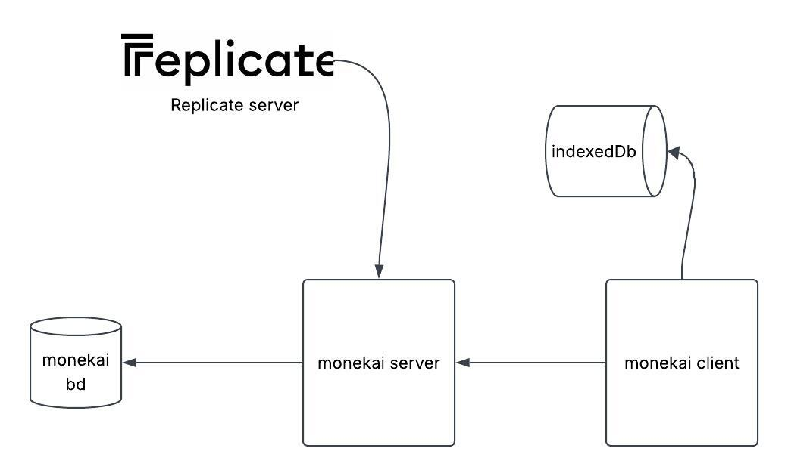

# Monekai Infrastructure

## Overview

Monekai follows a simple architecture designed to prioritize rapid development and fast iteration for the MVP. The application is composed of four primary components:

- **Angular Client** – User interface and audio editor.
- **Go Backend** – Business logic, authentication, orchestration, and persistence.
- **Replicate** – AI inference service used to generate music samples.
- **PostgreSQL** – Persistent storage for application data.

To provide a responsive editing experience, the frontend also uses **IndexedDB** to persist large audio blobs and complex editor configurations directly in the browser.

---

## Infrastructure Diagram

---

# Components

## Angular Client

The frontend is built with **Angular** and is responsible for the complete user experience.

Responsibilities include:

- User authentication.
- Displaying generated samples.
- Audio editing.
- Applying real-time audio effects.
- Sending AI generation requests.
- Receiving generation updates from the backend.
- Synchronizing data with the server.

Because the editor works with large audio files (`Blob`) and complex effect chains, much of the editing state is stored locally instead of constantly communicating with the backend.

---

## IndexedDB

IndexedDB serves as the local persistence layer of the audio editor.

It stores data that is either expensive to transfer continuously or unnecessary to persist until the user decides to save their work.

Examples include:

- Original audio blobs.
- Edited audio blobs.
- Cached decoded audio.
- Audio effect configurations.
- Reverse state.
- Editor session data.

### Why IndexedDB?

Using IndexedDB provides several advantages:

- Efficient storage of large binary audio files.
- Instant recovery of editing sessions.
- Reduced backend traffic.
- Better editing performance.
- Smooth browser-based audio processing.

This database exists only inside the user's browser and synchronizes with the backend only when necessary.

---

## Go Backend

The backend is implemented in **Go**.

It acts as the central coordinator of the application.

Its responsibilities include:

- Authentication.
- Authorization.
- Business logic.
- User management.
- Sample management.
- Communication with Replicate.
- Database persistence.
- Notifying the frontend when generated samples are ready.

The backend does **not** perform AI inference itself. Instead, it delegates generation tasks to Replicate.

---

## Replicate

Replicate provides the AI infrastructure used to generate music samples.

When a user requests a new sample:

1. The Angular client sends the request to the Go backend.
2. The backend validates the request and creates a prediction in Replicate.
3. Replicate executes the selected AI model.
4. Once generation finishes, Replicate sends a webhook to the backend.
5. The backend stores the generated sample in PostgreSQL.
6. The frontend is notified that the sample is available.

This approach keeps the backend lightweight while relying on specialized AI infrastructure for generation.

---

## PostgreSQL

PostgreSQL is the application's primary persistent database.

It stores information such as:

- Users.
- Samples.
- Sample metadata.
- Shared samples.
- User relationships.
- Application configuration.
- Other persistent entities.

Temporary editing assets are intentionally not stored here during editing because they are managed locally through IndexedDB.

---

# Why This Architecture?

The current architecture is intentionally simple to accelerate the development of the MVP while maintaining good separation of responsibilities.

Benefits include:

- Lightweight infrastructure.
- Fast local audio editing.
- Reduced network usage.
- Clear separation between frontend, backend, AI generation, and persistence.
- Easy deployment.
- Straightforward scalability for future improvements.

---

# Future Improvements

After the MVP launch, Redis will be introduced to improve scalability and performance.

Possible use cases include:

- Background job queues.
- Event distribution.
- Pub/Sub messaging.
- Temporary caching.
- Session storage.
- Distributed notifications.

Redis is intentionally postponed until after the MVP to avoid unnecessary infrastructure complexity during the first release.

---

# Technology Stack

| Layer | Technology |
|---------|------------|
| Frontend | Angular |
| Backend | Go |
| AI Inference | Replicate |
| Database | PostgreSQL |
| Browser Storage | IndexedDB |
| Future Cache & Messaging | Redis |